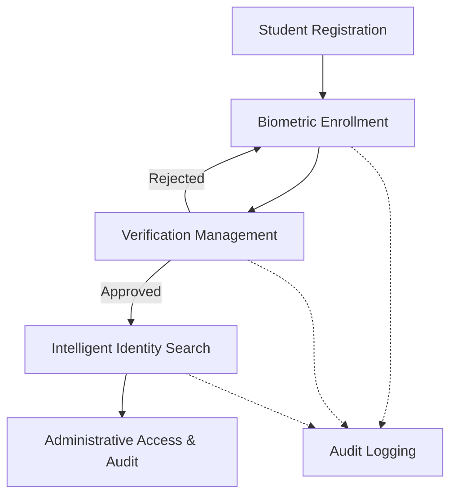
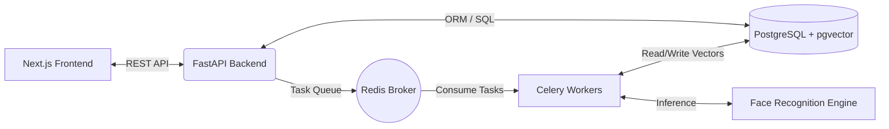

# DIU Lens
## AI-Powered Identity Verification Platform for Daffodil International University

  

**Team:** LensCore  
**Presenter:** Wahid Sadik  
**Competition:** DIU AI Project Competition 2026  

  

---

# 1. Executive Summary

DIU Lens is a comprehensive, AI-driven biometric facial recognition and identity verification platform designed specifically for Daffodil International University. Created to modernize campus security and streamline administrative workflows, the system replaces traditional, easily compromised identification methods with robust biometric authentication. The platform addresses the critical challenge of ensuring accurate and secure student identification across various campus facilities and examination halls. By leveraging advanced facial recognition models and vector similarity search, DIU Lens provides a scalable, privacy-conscious foundation for next-generation smart-campus applications.

---

# 2. Problem Statement

Traditional methods of student identification, such as physical ID cards and manual verification processes, present significant vulnerabilities and inefficiencies in modern university environments. Physical cards are frequently lost, forgotten, or intentionally transferred between individuals, compromising campus security and academic integrity during examinations. Furthermore, manual verification by administrative staff is prone to human error, visually fatiguing, and slow, particularly during high-traffic periods. These limitations highlight the urgent need for a scalable, digital identity system that provides frictionless, high-accuracy verification while mitigating the risks associated with conventional credentials.

---

# 3. Project Objectives

The primary objectives of the DIU Lens project include:

*   **Accurate Identity Verification:** Implement state-of-the-art facial recognition to definitively authenticate student identities with high confidence.
*   **Secure Biometric Enrollment:** Establish a robust registration workflow requiring multi-angle image capture to ensure high-quality enrollment data.
*   **Administrative Oversight:** Provide comprehensive dashboards for system administrators to manage student records, review edge cases, and audit system activity.
*   **Scalable Architecture:** Build a highly available, distributed backend capable of processing biometric tasks asynchronously without degrading user experience.
*   **Future Smart-Campus Integration:** Design the platform to act as a core authentication service for future applications, including automated attendance and secure access control.

---

# 4. System Overview

The DIU Lens ecosystem is designed around a structured, human-in-the-loop workflow that ensures both automation efficiency and administrative control. The lifecycle of a student identity within the system follows a clear progression from initial registration to ongoing verification.

Student Registration initializes the profile creation. This is followed by Biometric Enrollment, where the student provides multi-angle facial captures. Administrative staff then perform Verification Management to approve the biometric data. Once approved, the profile is available for Intelligent Identity Search, allowing rapid authentication. All operations are subject to continuous Audit Logging, accessible via the Administrative Dashboard.

---

# 5. Key Features

### Guided Biometric Enrollment
The foundation of accurate facial recognition relies heavily on the quality of initial reference data. DIU Lens features a guided biometric enrollment workflow that instructs students to provide captures from multiple angles. This comprehensive enrollment strategy maximizes data quality, resulting in robust vector embeddings that improve overall system accuracy and resilience against varying lighting conditions and facial expressions.

### Intelligent Identity Search
At the core of the platform is the intelligent identity search workflow. Utilizing advanced mathematical vector representations of facial features, the system rapidly searches through thousands of enrolled records to find candidate matches. Results are presented to administrators with confidence scores, enabling rapid authentication while maintaining human oversight for borderline matches.

### Verification Management
To ensure data integrity, DIU Lens incorporates a stringent verification management process. Newly enrolled biometric records do not immediately enter the active search pool. Instead, they require explicit administrative approval. This validation step prevents fraudulent or low-quality data from compromising the system's accuracy.

### Audit Logging
Accountability is a cornerstone of the DIU Lens architecture. The system maintains comprehensive audit logging for all critical actions, including enrollment attempts, verification approvals, and search queries. This continuous security monitoring provides administrators with an immutable record of system usage, facilitating investigations and ensuring compliance with institutional policies.

### Administrative Dashboard
The administrative dashboard serves as the central command interface for system management. It provides institutional staff with deep visibility into system operations, allowing them to oversee enrollments, review audit logs, and monitor overall system health from a unified, intuitive interface.

---

# 6. Current Progress

| Feature | Status | Completion |
| :--- | :--- | :--- |
| Homepage | Completed | 100% |
| Registration Flow | Completed | 100% |
| Enrollment Workflow | Completed | 100% |
| Verification System | Completed | 100% |
| Search Interface | Completed | 100% |
| Audit Logs | Completed | 100% |
| Admin Dashboard | Completed | 100% |
| Face Recognition Pipeline | In Progress | 60% |
| Vector Search Integration | Planned | 0% |
| Production Deployment | Planned | 0% |

---

# 7. Technology Stack

The technology stack for DIU Lens was selected to ensure maximum scalability, maintainability, and performance.

| Layer | Technologies | Justification |
| :--- | :--- | :--- |
| **Frontend** | Next.js, TypeScript, Tailwind CSS | Next.js provides robust server-side rendering and routing capabilities. TypeScript ensures type safety, reducing runtime errors. Tailwind CSS enables rapid, consistent UI development. |
| **Backend API** | FastAPI, SQLAlchemy, Pydantic | FastAPI offers exceptional asynchronous performance for API endpoints. SQLAlchemy provides a mature ORM, while Pydantic ensures strict data validation. |
| **AI Layer** | InsightFace, ONNX Runtime, OpenCV | InsightFace delivers state-of-the-art facial analysis models. ONNX Runtime provides optimized inference execution. OpenCV handles necessary image processing tasks. |
| **Database** | PostgreSQL, pgvector | PostgreSQL is a highly reliable relational database. The pgvector extension is crucial for storing and efficiently querying 512-dimensional face embeddings using vector similarity. |
| **Infrastructure** | Docker, Redis, Celery, DigitalOcean | Docker containerizes the application for consistent deployment. Celery and Redis manage the asynchronous queueing required for heavy biometric processing. DigitalOcean provides scalable cloud hosting. |

---

# 8. System Architecture

The DIU Lens architecture is structured as a modern, decoupled microservices ecosystem.

*   **Frontend:** A Next.js application handling the user interface, routing, and client-side validation.
*   **Backend API:** A FastAPI service acting as the central orchestrator, handling authentication, business logic, and API requests.
*   **Face Recognition Engine:** Specialized worker processes executing machine learning inference using ONNX and InsightFace to extract mathematical embeddings from images.
*   **Database Layer:** A PostgreSQL instance extended with pgvector to manage both relational data (users, logs) and high-dimensional vector data (biometrics).
*   **Storage Layer:** A scalable object storage system for retaining raw image data and processing artifacts.
*   **Background Processing:** A Celery-based asynchronous task queue, backed by Redis, responsible for offloading computationally intensive operations from the main API thread.

---

# 9. Innovation and Uniqueness

DIU Lens distinguishes itself from standard identity management solutions through its specialized focus on the academic environment and its robust enrollment methodology. While many systems accept single-image enrollments, DIU Lens mandates a multi-angle facial registration strategy, significantly increasing the quality of the biometric baseline. Furthermore, the platform embraces a "human-in-the-loop" philosophy. Rather than relying on autonomous, potentially flawed biometric decisions for critical administrative actions, the system acts as an intelligent assistant, surfacing high-confidence matches while reserving final verification authority for institutional staff. This approach balances technological innovation with necessary administrative oversight, creating a pragmatic and highly effective university-focused identity platform.

---

# 10. Security and Privacy Considerations

Safeguarding biometric data is paramount. DIU Lens implements a defense-in-depth approach to security and privacy:

*   **Role-Based Access Control (RBAC):** Strict access policies ensure that only authorized administrative personnel can access sensitive student records or approve biometric data.
*   **Audit Logging:** Every critical action, including data access and modification, is permanently recorded, establishing clear accountability.
*   **Controlled Administrative Access:** High-risk operations require elevated privileges, minimizing the potential impact of compromised standard accounts.
*   **Responsible Biometric Data Handling:** Facial embeddings are mathematical representations, not reversible images. They are stored securely and utilized strictly for the purposes of institutional identity verification, adhering to ethical standards of data privacy.

---

# 11. Future Roadmap

The development of DIU Lens follows a structured, multi-phase roadmap designed to systematically expand capabilities.

| Phase | Focus Area | Description |
| :--- | :--- | :--- |
| **Phase 1** | Core Platform | Development of the foundational architecture, user interfaces, registration workflows, and administrative dashboards. |
| **Phase 2** | Face Recognition Pipeline | Integration of the AI inference engine, model optimization, and asynchronous task processing. |
| **Phase 3** | Vector Search | Implementation and tuning of pgvector for high-performance similarity matching across the student database. |
| **Phase 4** | Production Deployment | Containerization, infrastructure provisioning, and deployment to a scalable cloud environment. |
| **Phase 5** | Smart Campus Integration | Exposing secure APIs to integrate DIU Lens with external campus systems such as automated attendance and physical access control. |

---

# 12. Expected Impact

The successful deployment of DIU Lens will yield significant operational benefits for Daffodil International University. By migrating to a robust digital identity management system, the university will dramatically enhance campus security, particularly in sensitive areas such as examination halls. Administrative efficiency will improve as time-consuming manual verification processes are replaced by instantaneous, automated matching. Furthermore, the platform establishes a reliable technological foundation for future innovations, paving the way for advanced attendance systems and seamless access control, ultimately contributing to a safer and more technologically advanced academic environment.

---

# 13. Conclusion

DIU Lens represents a significant advancement in institutional identity management. By combining state-of-the-art artificial intelligence with a robust, scalable architecture, the platform effectively addresses the limitations of traditional verification methods. The current progress demonstrates a fully functional administrative foundation, with the core AI and vector search integrations actively under development. Ultimately, DIU Lens will provide Daffodil International University with a secure, efficient, and forward-looking digital identity ecosystem, fulfilling the immediate need for reliable authentication while establishing the infrastructure for the smart campus of the future.
